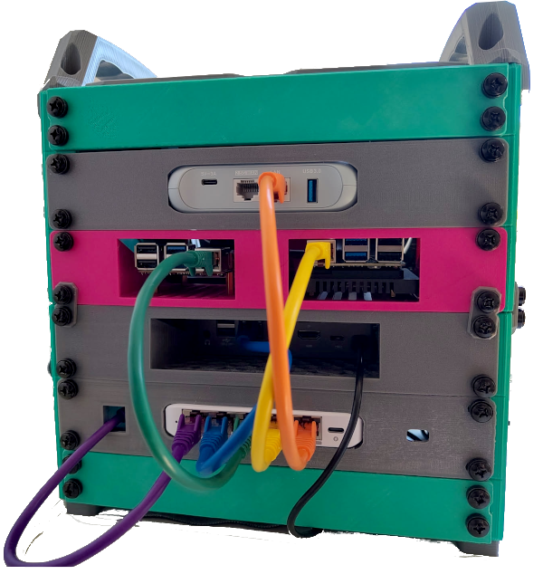

# llm_stack

IaC for a bootstrapped local LLM stack. This stack serves as a reproducible and offline-capable (after initial provisioning) environment for testing agents, pipeline orchestration, MCP servers and security boundaries.



Developed using readily available hardware:

- Controller SBC to handle bootstrapping and provisioning (2 GB RAM, 32 GB eMMC)
- Mini PC with Proxmox
- LLM server SBC (32 GB RAM, 128 GB eMMC)

Note that this is not a high-performance stack; for many use cases, running `llama.cpp` on a SBC is not practical. 

Briefly: 

- The controller SBC is provisioned with this repository, the configuration of the bare-metal hosts and the configuration of the stack
- OpenTofu automates LXC provisioning on the Proxmox host:
    - A `networkservices` host for deploying Caddy and Unbound
    - A `dockerservices` host for deploying Open WebUI, ntfy and Vaultwarden
- Ansible provisions and configures services on bare-metal and virtualized hosts
- A travel router provides offline WiFi; Unbound DNS resolves internal service domains without external dependencies

Structure: 

```
llm_stack/
├── ansible/
│   ├── inventory/
│   ├── playbooks/
│   └── roles/{caddy,docker_engine,docker_stack,hardening,llama_cpp,unbound}
├── opentofu/
|   ├── modules/{lxc,storage}
│   ├── main.tf
│   ├── variables.tf
│   └── outputs.tf
├── docs/
└── README.md
```

See the [docs](docs/README.md) for additional documentation. 

## Planned milestones

- Secrets provisioning using Vaultwarden
- Forgejo git server with automatically provisioned service accounts for agents
- Flexible deployment of MCP servers
- MCP server using Proxmox and Ansible for sandboxed code execution
- Prometheus and Grafana as Docker services
- Make Caddy DNS challenge optional for fully offline deployment

Some of these milestones will likely be released as separate repositories. 

## Disclaimer

This project is an early WIP and relies heavily on specific infrastructure configurations. Moreover, it is an IaC playground for experimenting with infrastructure and automated provisioning for GenAI systems; this is not production-ready infrastructure. 
