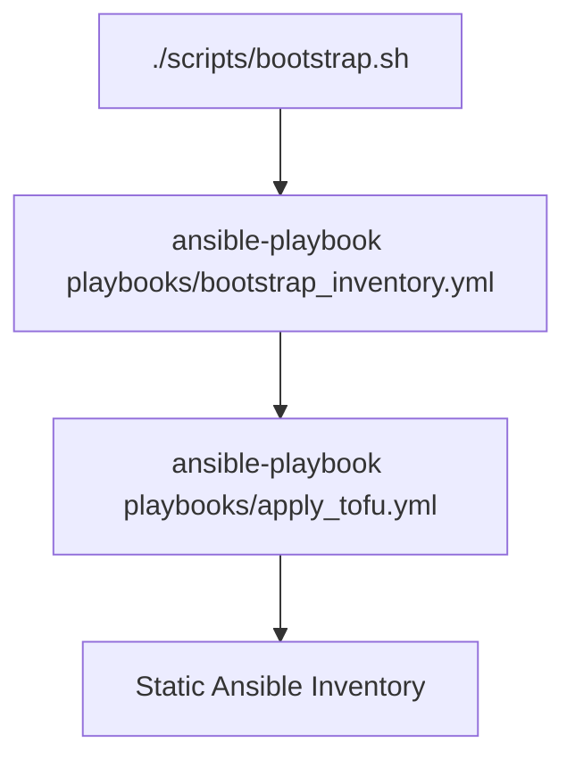

# LLM stack controller

Ansible + OpenTofu bootstrapper for self-hosted LLM infrastructure. 

**Quickstart**

1. Clone and navigate to the repository folder
2. Run `./scripts/bootstrap.sh` (interactive config and vault setup)
  - To run only LXC provisioning, use `ansible-playbook playbooks/apply_tofu.yml`
3. Run `ansible-playbook playbooks/hardening.yml -i inventory/static_hosts.yml -i inventory/tofu_generated.json` (secures SSH access)
4. Deploy services:
    - `ansible-playbook playbooks/deploy_dns.yml`
    - `ansible-playbook playbooks/deploy_services.yml`
    - `ansible-playbook playbooks/provision_llama_cpp.yml`

This is sufficient to create a usable LLM server that you can access using Open WebUI (through `chat.<domain.org`>). 
The next steps set up Vaultwarden and Forgejo for machine users. 

5. Open vaultwarden.<domain.org> and log in as admin using the password you set in `./scripts/bootstrap.sh`
6. Get the client ID and API key from the Vaultwarden settings
7. Set them in the vault using `./scripts/vault_api.sh`
8. Set up the secrets lifecycle: `ansible-playbook playbooks/secrets_lifecycle.yml`
9. Set up a Forgejo server with machine users: `ansible-playbook playbooks/deploy_forgejo.yml` 

These additional steps create Vaultwarden and Forgejo accounts for each machine user specified in `group_vars/services/agents.yml`. Agents can retrieve credentials they need from their own Vaultwarden account, removing the need to store credentials in plain text. Moreover, the Forgejo server can be used to have agents contribute to code, with the default agent profiles restricting their permissions. 

**Documentation**

- [Architecture](docs/architecture.md)
- [Prerequisites](docs/prerequisites.md)
- [Security](docs/security.md)
