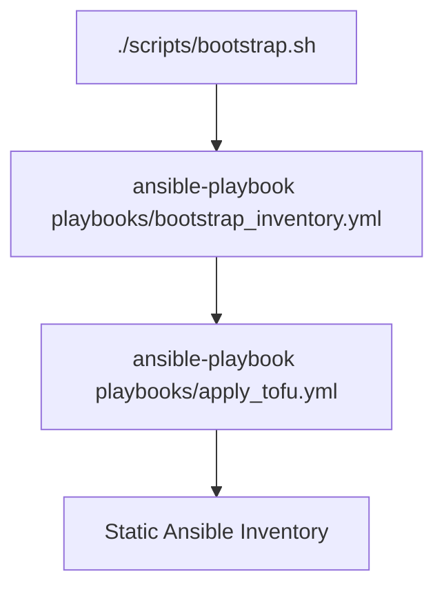

# LLM stack controller

Ansible + OpenTofu bootstrapper for self-hosted LLM infrastructure. 

**Quickstart**

1. Clone and navigate to the repository folder
2. Run `./bootstrap.sh` (interactive config and vault setup)
  - To run only LXC provisioning, use `ansible-playbook playbooks/apply_tofu.yml`
3. Run `ansible-playbook playbooks/hardening.yml -i inventory/static_hosts.yml -i inventory/tofu_generated.json` (secures SSH access)
4. Deploy services:
    - `ansible-playbook playbooks/deploy_dns.yml`
    - `ansible-playbook playbooks/deploy_services.yml`
    - `ansible-playbook playbooks/provision_llama_cpp.yml`

After the last step, you should be able to access services using your domain, e.g.:

- chat.<domain.org> - Open WebUI
- vaultwarden.<domain.org> - Vaultwarden
- ntfy.<domain.org> - ntfy

**Documentation**

- [Architecture](docs/architecture.md)
- [Prerequisites](docs/prerequisites.md)
- [Security](docs/security.md)
